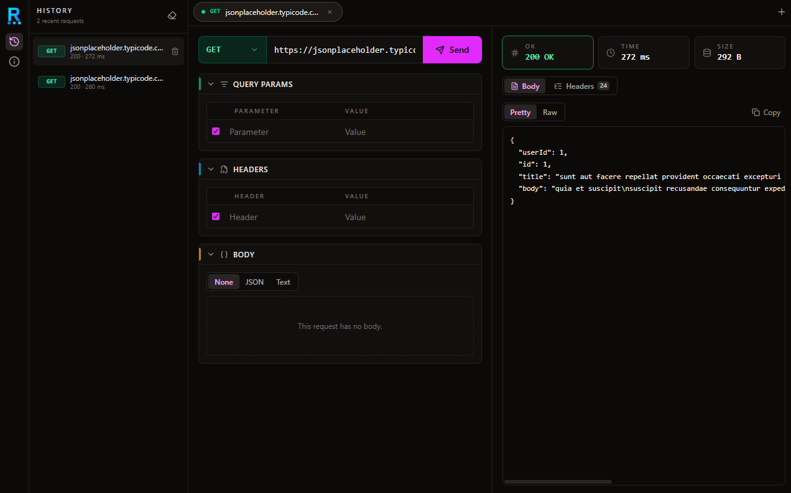

<div align="center">
  <div align="center">
    
  </div>
  
  # Reqlify

  **A lightning-fast, offline-first HTTP client for the desktop.** <br />
  Compose requests, fire them at any API, and inspect the response — entirely locally. No accounts, no cloud sync, no telemetry. Just ship one binary and go.

  [](https://react.dev/)
  [](https://tauri.app/)
  [](https://www.rust-lang.org/)
  [](https://www.typescriptlang.org/)
  [](https://tailwindcss.com/)
</div>

---


*Reqlify in action: Fetching data from JSONPlaceholder with a beautifully formatted JSON response.*

## 💡 Why Reqlify?

Most modern API clients have become bloated electron apps tied to cloud accounts and forced synchronization. 

I built **Reqlify** to solve a simple developer problem: I wanted a tool that opens instantly, respects my privacy, and relies on native OS capabilities rather than heavy browser abstractions. It's designed to be the perfect companion for local backend development and quick API testing.

## ✨ Key Features

- 🛡️ **True Local-First:** Every request, header, and saved tab lives strictly on your machine via `localStorage`. No backend, no login.
- 🚀 **Native Networking:** Requests are dispatched via Rust's `reqwest` under the hood. This means **zero CORS issues** and highly accurate timing metrics that reflect real network round-trips, not browser overhead.
- 🎨 **Side-by-Side Workbench:** Unlike traditional top/bottom layouts, Reqlify uses a document-and-preview style left/right split. Compose your request on the left, read the response on the right.
- 📑 **Persistent Multi-Tab Editor:** Work on multiple endpoints in parallel. Close the app, and everything is exactly where you left it upon restart.
- ⏪ **Replayable History:** Automatically logs recent requests locally. Re-run past endpoints with a single click.
- ⌨️ **Developer-Centric UX:** Auto-growing key/value tables, auto-formatting for JSON bodies, and native keyboard shortcuts (`Ctrl/Cmd + Enter` to send).

## 🛠️ Tech Stack & Architecture

This project was built to demonstrate full-stack desktop application development, bridging a high-performance Rust backend with a modern React frontend.

### Frontend
- **Framework:** React 19 + TypeScript + Vite
- **Styling:** Tailwind CSS 4 (using a custom dark "stone/fuchsia" palette)
- **State Management:** Zustand (with custom `localStorage` hydration/persistence)
- **Icons:** Lucide React

### Core (Backend)
- **App Framework:** Tauri 2 (Lightweight, secure OS integration)
- **Language:** Rust
- **HTTP Client:** `reqwest` (Handles the actual HTTP transport, bypassing browser restrictions)

### Project Structure (Feature-Sliced Design)

The frontend is organized using a feature-based architecture to keep domain logic isolated and scalable:

```text
src/
├── components/     # Reusable UI primitives (Buttons, Inputs, Layout containers)
├── features/       # Domain-specific modules:
│   ├── about/      # App info
│   ├── history/    # Request history logging & replay
│   ├── request/    # URL bar, Method picker, Body/Headers editors
│   ├── response/   # Response body viewer, JSON formatter, Stat tiles
│   └── tabs/       # Multi-tab management
├── store/          # Zustand global state (tabsStore, historyStore)
├── lib/            # Tauri command wrappers & Storage abstractions
└── utils/          # Pure helpers (formatters, ID generators, status theming)
src-tauri/
├── src/http.rs     # Rust implementation of the native HTTP client (`reqwest`)
└── src/lib.rs      # Tauri entry point & command registration
```

## 🚦 Getting Started

### Prerequisites
- [Node.js](https://nodejs.org/) (v18+)
- [Rust](https://www.rust-lang.org/tools/install)
- OS-specific Tauri dependencies (see[Tauri Setup Guide](https://tauri.app/v1/guides/getting-started/prerequisites))

### Installation

1. Clone the repository:
   ```bash
   git clone https://github.com/YOUR_USERNAME/reqlify.git
   cd reqlify
   ```

2. Install frontend dependencies:
   ```bash
   npm install
   ```

3. Run the development server (starts both Vite and the Tauri window):
   ```bash
   npm run tauri dev
   ```

### Building for Production

To compile a highly optimized, standalone executable for your operating system:

```bash
npm run tauri build
```
The compiled binaries/installers will be available in `src-tauri/target/release/bundle/`.

## 🔄 Continuous Integration

This project uses GitHub Actions for CI. Any Pull Request opened against the `main` branch from a `dev/*` branch automatically triggers a workflow (`.github/workflows/pr-build.yml`). This workflow:
- Verifies the frontend build.
- Runs `tauri build` on both Windows and Linux as a comprehensive smoke test.

## 📄 License

This project is open-source and available under the [MIT License](LICENSE).